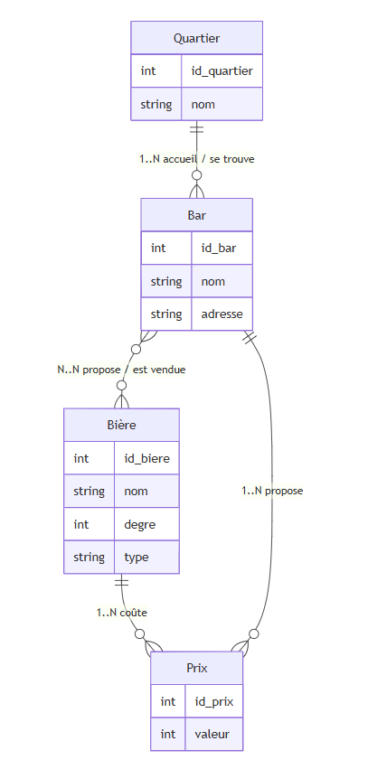

# MCD (Modèle Conceptuel de Données)

## Code du MCD

```
erDiagram
direction TB

    Quartier {
        int id_quartier
        string nom
    }

	Bar {
		int id_bar
		string nom
		string adresse
	}

	Bière {
		int id_biere
		string nom
		int degre
		string type
	}

	Prix {
		int id_prix
		int valeur 
	}

    Quartier ||--o{ Bar : "1..N contient / appartient à"
    Bar ||--o{ Prix : "1..N définit / est défini par"
    Bière ||--o{ Prix : "1..N  est vendue à / correspond à"
```

## Schéma du MCD
